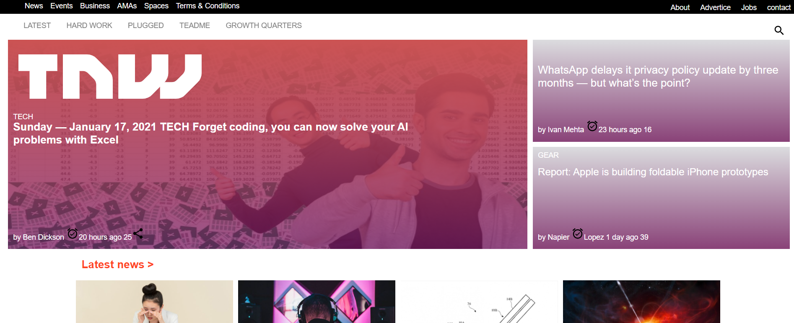
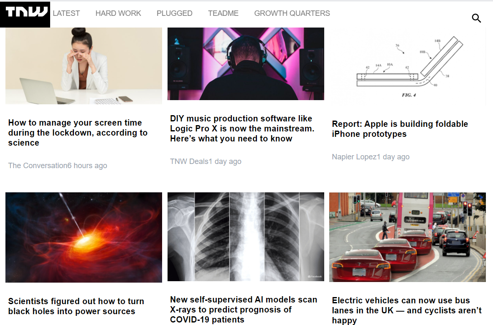

# HTML/CSS Responsive Design Project (Clone of thenextweb website)

This project is a responsive website  developed in the HTML & CSS project of the Microverse main curriculum. It is a collaborative project intended to showcase  the use of media queries to make website responsive. It is a clone of the thenextweb website. It is adaptive to different standard screen sizes ( mobile, tablet, and desktop).

## Desktop

## Tablet

## Mobile

## Built With

- HTML
- CSS

## Live Demo
[The nextweek clone Live version]("https://rawcdn.githack.com/prolajumokeoni/The-Next-Web/9d56f4ded445fa451a1ce60a064939def16ca662/index.html")

## Author 1
👤 **Tedros Tesfay**
- [Github](https://github.com/tta2yta)
- [Email](tta2yta@gmail.com)

## Author 2
👤 **Oni Olajumoke Priscilla**

- [Github](https://github.com/prolajumokeoni)
- [Email](prolajumokeoni@gmail.com)

## 🤝 Contributing

Contributions, issues and feature requests are welcome!

Feel free to check the [issues/page]("https://github.com/prolajumokeoni/The-Next-Web/issues/1#issue-795117627").

## Show your support

Give a ⭐️ if you like this project!

## Acknowledgments
[microverse.org](https://www.microverse.org/)

[ZATTIX Mohammed Awad](https://www.behance.nehttps://www.microverse.org/t/gallery/24796463/ZATTIX)

[w3schools.com](https://www.w3schools.com/)

[The Odin Project](www.theodinproject.com)

[Stackoverflow](https://www.stackoverflow.com/)

[CSS-TRICKS](https://css-tricks.com/)
